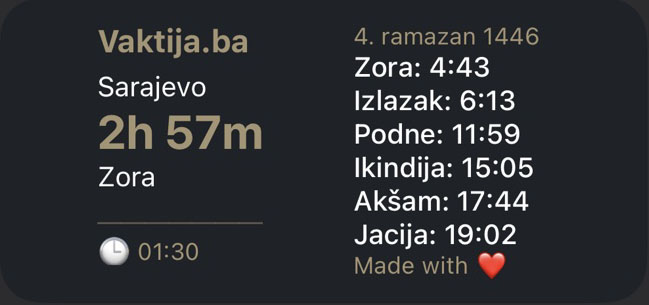
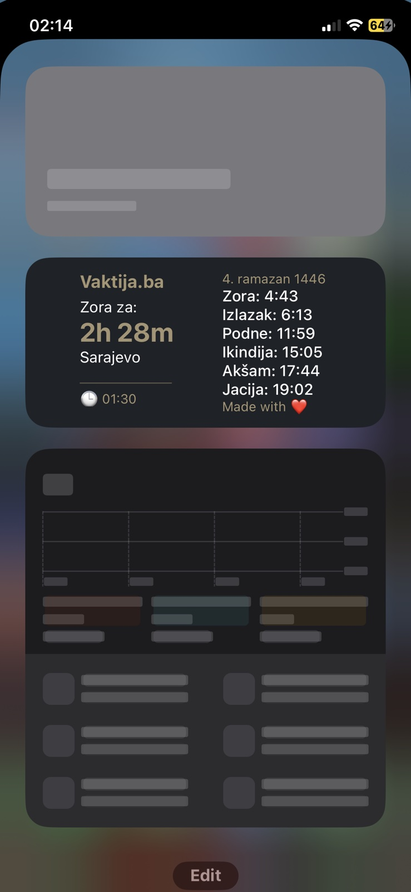
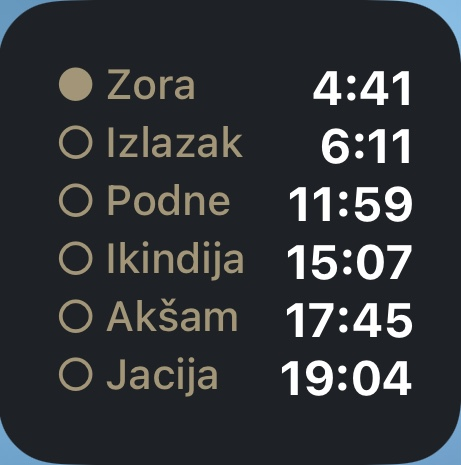
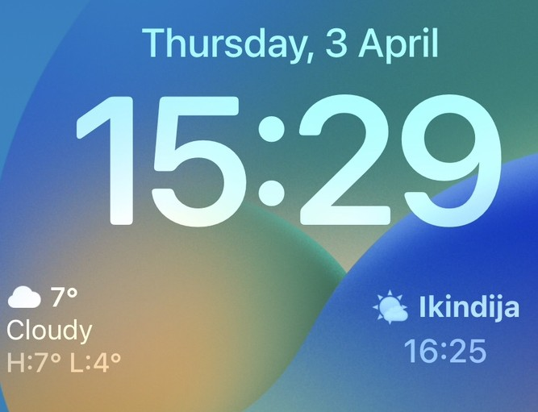

# Scriptable Vaktija Widget  

|  Section |  Link |
|------------|--------|
| Features | [Go to Features](#features) |
| Design | [Go to Design](#design) |
| Preview | [Go to Preview](#preview) |
| Installation | [Go to Installation](#installation) |
| Usage | [Go to Usage](#usage) |
| Customization | [Go to Customization](#customization) |
| City Codes | [Go to City Codes](#city-codes) |
| Known Issues & Limitations | [Go to Known Issues & Limitations](#issues) |
| Credits | [Go to Credits](#credits) |

This repository contains a **Scriptable widgets** for the Scriptable app available for iPhone and iPad devices that displays Islamic prayer times for **Bosnia and Herzegovina and Sandžak**. The widgets uses the **Vaktija.ba API** to fetch accurate prayer times but is **not affiliated** with Vaktija.ba in any way.  

Designed for a **horizontal layout**, **regular layout** and **lockscreen layout**, the widgets follows the **original Vaktija.ba colors and feel**, providing a seamless and familiar experience.  

> ℹ️ The default city in the widget is **Sarajevo (ID 77)**. To change the city code, visit [City Codes](#city-codes).

## Features

-   Displays Islamic prayer times for Bosnia and Herzegovina and Sandžak.
-   Uses **Vaktija.ba API** for accurate prayer times.
-   Three types of layout with a modern and clean look.
-   Shows a **countdown to the next prayer** for better time tracking*.
-   Uses the **original Vaktija.ba colors and feel**.
-   Automatically updates at **00:00** and when the widget is loaded.

**⚠️ Note:** Countdown problems exists due Apple widget limitations.

## Design  

The **Scriptable Vaktija Widget** is designed with a **horizontal layout**, ensuring a clean and structured display of prayer times. The design follows the **original Vaktija.ba colors and feel**, providing a familiar experience.  

### Colors  
- **Background**: `#1e2227` (Dark theme for better contrast)  
- **Header & Countdown**: `#a59573` (Inspired by Vaktija.ba's aesthetic)  
- **Text**: White (`#ffffff`) for optimal readability  

### Layout  
The widget is divided into **two columns**:  
1. **Left Column**  
   - Displays the **Vaktija.ba header**  and a **name of the upcoming prayer**
   - Shows a **countdown** ⏳ to the next prayer time  
   - Below the countdown, the **name of the chosen city** is displayed  
   - A horizontal separator (`
`) for visual clarity  
   - **Last fetched time** 🕒 (Indicates when the API was last accessed)  

2. **Right Column**  
	- **The Hijri calendar** date
   - Displays **prayer times for the day** in a structured list  
   - Centered for balance and readability  

### Countdown  
The countdown dynamically updates and shows the **remaining time** until the next prayer. This ensures users always have a quick glance at how much time is left before the upcoming prayer.  

Due to Apple widget limitations, the countdown updates every minute, and displaying seconds is not supported.

### Last Fetched Time  
The **🕒 last fetched time** at the bottom of the left column shows when the API was last accessed. The widget only fetches new data **once on load and at midnight (00:00:00)** to avoid unnecessary API requests.  

## Preview

There are currently two types of widgets available, both designed to enhance your experience. Regardless of which one you choose, the installation process remains the same.

### Regular widget

The widget follows a horizontal layout and is available in two file formats: **Vaktija.ba.scriptable** and **Vaktija.ba.scriptable.js**.
It provides additional details such as the selected location, a countdown timer to the next prayer, and the Hijri calendar date. However, it requires a full horizontal layout on iPhone to display all information properly.

### Mini widget

Regular layout. File name **Vaktija Mini Widget.scriptable** and **Vaktija Mini Widget.scriptable.js**.
It does not display details such as the selected location or countdown timer, but **it visually indicates the next prayer time using circles** - only the upcoming prayer will have a filled circle, while the others remain empty.

### Lockscreen widget

Layout focused for lockscreens. File name **Lockscreen Vaktija.scriptable** and **Lockscreen Vaktija.scriptable.js**.
**It displays only the name and time of the next prayer**.

**⚠️ Note:** Use horizontal lockscreen layout.

## Installation  

First, download the Scriptable app from the App Store: [Scriptable on App Store](https://apps.apple.com/ba/app/scriptable/id1405459188).

### Install from Scriptable Gallery  
*To be added*  

### Install from File  
1. Download the file **Vaktija.ba.scriptable**, **Vaktija Mini Widget.scriptable** or **Lockscreen Vaktija.scriptable** from this repository.  
2. Open the **Scriptable** app on your iPhone.  
3. Tap the **+** button to create a new script.  
4. Select **Import Script**, then choose script you downloaded.  
5. Save the script and add the widget to your home screen.  

### Manual Install  
1. Open the file **Vaktija.ba.scriptable.js**, **Vaktija Mini Widget.scriptable.js** or **Lockscreen Vaktija.scriptable** in this repository.  
2. Copy the entire content of the file.  
3. Open the **Scriptable** app on your iPhone.  
4. Tap the **+** button to create a new script.  
5. Paste the copied content into the editor.  
6. Save the script and add the widget to your home screen.  

### Usage

 1. **Add the widget to your home screen:**
    -   Long press on your home screen until the apps start jiggling.
    -   Tap the **“+” button** in the top left corner.
    -   Search for **Scriptable** and select it.
    -   Choose the **right size for a widget** and add it.
  
 2.  **Set up the widget:**
   
	   -    Tap on the edit widget while in jiggle mode.
	   -    Choose the script **"Vaktija.ba"**, **Vaktija Mini Widget"** or **Lockscreen Vaktija.scriptable** from the list.
	   -    Ensure the **widget refreshes properly** by allowing background updates.

## Customization

You can modify the script inside **Scriptable** to adjust certain aspects:

-   **City Code:** Change the `CITY` variable in the script to fetch data for a different location.
-   **Colors:** Modify `backgroundColor`, `textColor`, or `headerColor` in the script for a different look.
-   **Font Size:** Increase or decrease `Font.systemFont(size)` for better readability.

**⚠️ Note:** Ensure that any modifications follow Scriptable’s syntax rules to avoid errors.

### City codes
You can find the available city codes here: [city-codes.md](city-codes.md) or on the official site of Vaktija.ba: https://api.vaktija.ba/vaktija/v1/lokacije 

To change the city in the script, find your city ID from the link above and modify the following line in the script:

    const  CITY  =  "77";

**City ID 77** is for **Sarajevo**.

Replace `77` with the ID of your preferred city to display prayer times for that location.

## Issues

-   Due to **Apple widget limitations**, the **countdown updates every minute** (seconds are not displayed).
-   Widgets on iOS **refresh in the background every 15-30 minutes**, so real-time updates are not guaranteed.
-   If the widget **doesn’t update**, manually open **Scriptable** and run the script to force a refresh.

## Credits

### Author
-   **Created by:** MuxBH28
-   **Website:** [muxbh28.github.io](https://muxbh28.github.io)
-   **Email:** sehicmuhammed7@proton.me
-   **GitHub:** [github.com/MuxBH28](https://github.com/MuxBH28)

### Testers

A huge **thank you** to those who helped test the widget!

### Data Source

This widget retrieves prayer times from the **[Vaktija.ba](https://vaktija.ba/)** API.  
A big thanks to them for providing this valuable service!

**Disclaimer:** This project is **not affiliated** with Vaktija.ba in any way.